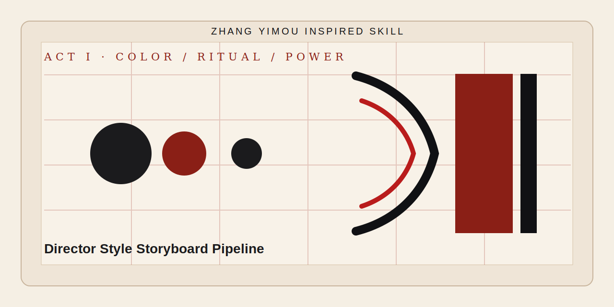

<div align="center">

# 张艺谋.skill

<p align="center">
  
</p>

> *先让冲突可见，再让画面好看。*

[](https://agentskills.io)
[](https://skills.sh)
[](#安装)
[](#输出什么)

<br>

**张艺谋启发的导演操作系统。不是风格滤镜，是可运行的短剧导演流程。**

<br>

基于公开作品、公开访谈和可观察影像语言，<br>
把强色彩叙事、仪式化调度、群像压迫、空间权力、道具母题，<br>
转译成短剧剧本、专业分镜、故事版和 Seedance 视频 prompt。

[看效果](#效果示例) · [安装](#安装) · [输出什么](#输出什么) · [蒸馏了什么](#蒸馏了什么) · [安全边界](#安全边界)

</div>

---

## 效果示例

### 问：把“婆婆在婚宴上羞辱儿媳，儿媳反击”做成张艺谋启发的短剧开场。

```text
张艺谋.skill  ❯ 这个故事真正拍的不是婆媳吵架，而是一个家族如何用婚宴审判一个外来者。

                主引擎：仪式即牢笼。
                副引擎：物件作为判决。

                第一秒，不要先给台词。给一只红色喜碗落在地上，汤汁沿着白瓷砖流开。
                第二秒，镜头抬起，看到一整桌亲戚同时停筷，所有人的脸都朝向新娘。
                第三秒，婆婆把红包推回去，只说一句：这钱，我们家不认。

                儿媳不要立刻爆发。她先把碎碗捡起来，把手指划破。
                血滴进红汤里，颜色变深。她抬头，看向门口正在录像的手机。

                反击动作不是吵赢，而是把一张医院病历放到喜桌中央。
                婚宴从祝福现场，变成公开审判现场。
```

> 运用了**仪式化调度**、**群像压迫个体**、**物件反转意义**，把家庭冲突转成可拍的社会压力。

### 问：我要一个 15 秒投流短剧视频 prompt，竖屏，强钩子。

```text
张艺谋.skill  ❯ 15 秒不能拍“电影感”，要拍一个能被立刻看懂的权力换位。

                0-3s：竖屏近景，一枚公章悬在辞退通知上方，迟迟不落。
                3-7s：女工站在玻璃门外，门内七个管理层排成一条直线，像审判席。
                7-11s：她从布包里拿出旧工牌，工牌背面夹着事故照片。
                11-15s：公章落下，但盖在事故照片上。办公室里所有人同时沉默。

                色彩：冷白办公室 + 暗红公章 + 褪色蓝工牌。
                声音：空调低频、印泥摩擦、盖章声骤然放大。
                竖屏构图：门框把女工压在下三分之一，直到最后一秒她占满中心。
```

> 运用了**空间先于台词**、**声音压力**、**竖屏压缩规则**，让信息流用户在前 3 秒看懂冲突。

### 问：只给我一个分镜表，不要长篇解释。

| 镜号 | 景别 | 画面 | 运镜 | 声音 | 功能 |
| --- | --- | --- | --- | --- | --- |
| 1 | 特写 | 红布下露出半张欠条 | 慢推 | 鼓点一下 | 抛出秘密 |
| 2 | 中景 | 全家围桌，女主被空椅隔开 | 固定 | 筷子停住 | 建立审判场 |
| 3 | 近景 | 父亲把钥匙压在欠条上 | 俯拍 | 金属磕桌 | 权力落下 |
| 4 | 特写 | 女主指尖按住钥匙，不让它滑走 | 静止 | 呼吸声 | 第一次反抗 |
| 5 | 全景 | 所有人同时转头看她 | 轻微后撤 | 沉默 | 群像压迫 |

> 不是复刻某部电影，而是把“强色彩、仪式、空间、群像、道具”变成短剧生产语言。

---

## 安装

本 skill 基于开放的 [Agent Skills](https://agentskills.io) 协议，可在支持 skills 的 AI agent runtime 中运行。

### 方式一：一行命令

```bash
npx skills add Ye-Zayne/zhang-yimou-skill
```

### 方式二：手动安装

<details>
<summary>展开查看常见 runtime 的 skills 目录</summary>

| Runtime | 安装路径 |
| --- | --- |
| Claude Code | `~/.claude/skills/zhang-yimou-skill/` |
| Codex CLI | `~/.codex/skills/zhang-yimou-skill/` |
| Cursor | `~/.cursor/skills/zhang-yimou-skill/` |
| OpenClaw | `~/.openclaw/workspace/skills/zhang-yimou-skill/` |

```bash
git clone https://github.com/Ye-Zayne/zhang-yimou-skill <对应路径>
```

</details>

### 使用

```text
> 用张艺谋Skill把这个短剧项目做成导演版
> 把这段剧情改成张艺谋启发的分镜脚本
> 生成竖屏短剧的导演分镜表和 Seedance prompt
```

---

## 输出什么

### 小任务默认输出

1. **一句话导演判断**：这个故事真正拍的不是 X，而是 Y。
2. **风格引擎**：主引擎 + 副引擎。
3. **视觉母题表**：颜色、物件、空间、群像、声音。
4. **正文生成**：剧本、分镜、故事版或视频 prompt。
5. **反模式检查**：避免廉价“大红灯笼式”的表面模仿。

### 完整项目输出

```text
storyboard_pipeline/{项目名}/
├── 00_流程清单.md
├── docs/
│   ├── 00A_导演风格设定.md
│   ├── 01_规范剧本.md
│   ├── 02_专业分镜脚本.md
│   └── 04_Seedance_视频Prompt_15秒单元.md
├── characters/
├── scenes/
├── storyboards/
├── director_sheets/
├── video_grids/
└── videos/
```

完整流程遵循：风格锁定 → 剧本规范化 → 专业分镜 → 导演分镜表 → 人物/场景设定 → 静态确认 → 视频 prompt → 视频宫格/视频。

---

## 蒸馏了什么

### 9 个导演引擎

| 引擎 | 一句话 |
| --- | --- |
| **色彩即命运** | 颜色不是装饰，是人物关系和权力变化。 |
| **仪式即牢笼** | 婚宴、晨会、排队、盖章等重复动作暴露控制。 |
| **群像压迫个体** | 一个人被队列、墙面、旁观者和手机镜头吞没。 |
| **空间先于台词** | 院落、楼道、窗口、宴席、办公室先决定权力。 |
| **物件作为判决** | 碗、章、合同、红包、病历、钥匙在最后反转意义。 |
| **女性策略性主体** | 女性不是被观看的受害者，而是在规则里计算、忍耐、误导、反击。 |
| **小人物现实主义** | 目标很小，但追问到底会变成道德力量。 |
| **类型片压力锅** | 一夜、一宴、一楼、一间办公室内连续升级。 |
| **奇观服务命题** | 大场面必须让观众一眼看懂主题。 |

### 表达方式

- **导演判断**：先判断冲突，不急着堆画面。
- **镜头策略**：景别、机位、站位、运镜都服务人物压力。
- **短剧压缩**：前 3 秒给图像钩子，每 10-15 秒一次权力变化。
- **可生产交付**：输出能直接进入分镜、图片生成、Seedance prompt 和剪辑流程。

---

## 仓库结构

```text
.
├── SKILL.md
├── agents/
│   └── openai.yaml
├── assets/
│   └── hero.svg
└── references/
    ├── director-system.md
    ├── filmography-style-map.md
    ├── output-templates.md
    ├── pipeline-output-standard.md
    ├── short-drama-playbook.md
    ├── storyboard-board.md
    └── visual-language-library.md
```

---

## 安全边界

这个 skill 不扮演张艺谋本人，也不代表张艺谋本人、其团队或任何授权观点。它只使用公开可观察的高层导演原则，避免复制具体电影的完整场景、台词、分镜序列或可识别桥段。

如果用户询问事实、奖项、片单、最新作品或访谈原话，应先查证再回答。
