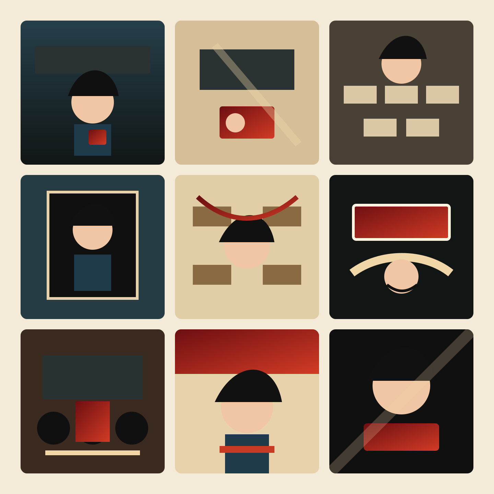
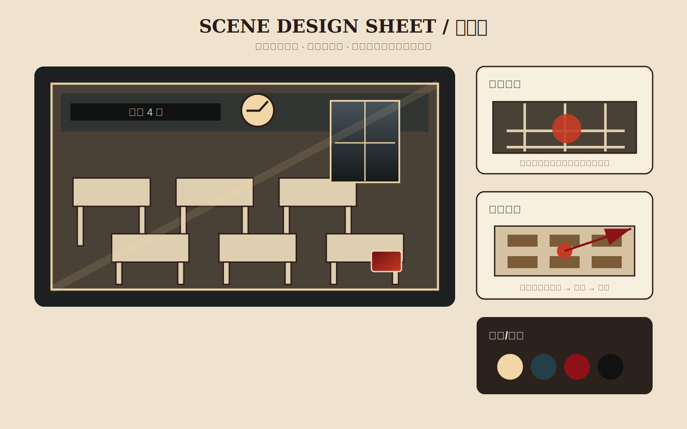
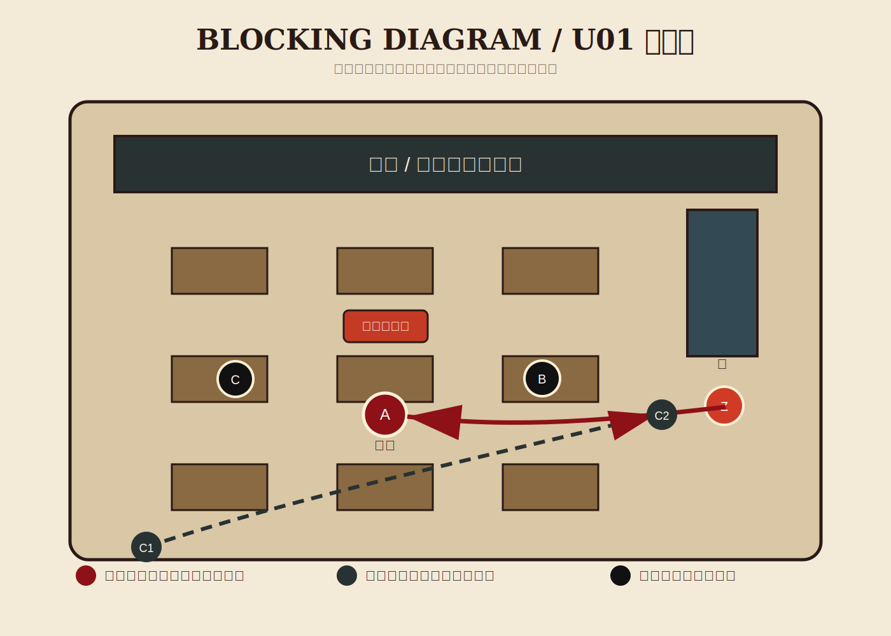

<div align="center">

# 张艺谋Skill

<p align="center">
  
</p>

> *先让冲突可见，再让画面好看。*

[](https://agentskills.io)
[](#安装)
[](#全模型适配)

**张艺谋Skill：把一句短剧灵感轰成导演风格设定、剧本、彩色故事版、3x3九宫格、Seedance视频Prompt、全模型适配和自动剪辑工程。**

基于公开作品、公开访谈和可观察影像语言，把强色彩叙事、仪式化调度、群像压迫、空间权力、道具母题，转译成短剧剧本、专业分镜、图片故事版、视频 prompt 和可执行生产清单。

[完整图片案例](#完整图片案例) · [输出流程](#输出流程) · [安装](#安装) · [全模型适配](#全模型适配) · [安全边界](#安全边界)

</div>

---

## 完整图片案例

仓库已内置一个完整案例：[examples/complete-case/gray-bell-campus](examples/complete-case/gray-bell-campus)。

题材：男主是一名学生，在校园异常循环中醒来，发现一张猩红学生卡成为秩序变化的证据。

### 彩色故事版大图


### 严格 3x3 九宫格



### 人物、场景、站位图

| 人物设定图 | 场景设定图 | 站位图 |
| --- | --- | --- |
|  |  |  |

> 这些是仓库内真实图片文件，不是文字占位。故事版可以带镜号和说明；3x3 视频参考图保持无字幕、无镜号、无水印，方便直接投给视频模型。

---

## 输出流程

一个完整短剧项目默认按七步走：

| 阶段 | 输出 |
| --- | --- |
| 1. 剧本与流程清单 | `docs/01_剧本与流程清单.md`，同时列出人设图、场景图、故事版、九宫格、视频和剪辑检查项 |
| 2. 镜头表与单元切分 | `docs/02_镜头表与单元切分.md`，拆镜号、景别、运镜、声音、时长和 Seedance 单元 |
| 3. 站位图 | `blocking/` 或 `images/blocking_*.svg`，表达人物位置、机位、摄影轴线和压力方向 |
| 4. 分镜表/故事版 | `storyboards/`，必须包含图片故事版或九宫格，不接受纯文字占位 |
| 5. Seedance Prompt 逐单元 | `docs/05_Seedance_Prompt_逐单元.md`，按每个 10-15 秒视频单元生成 |
| 6. 即梦 CLI 视频生成 | 先询问用户是否需要；需要时再填入即梦/Dreamina CLI 参数批量生成 |
| 7. 自动剪辑 | 先询问用户是否需要；需要时输出剪辑 manifest、ffmpeg/剪映/CapCut 可执行方案 |

推荐目录：

```text
storyboard_pipeline/{项目名}/
├── 00_流程清单.md
├── docs/
├── characters/
├── scenes/
├── blocking/
├── storyboards/
├── video_grids/
├── adapters/
├── manifests/
├── videos/
└── edit/
```

---

## 安装

```bash
npx skills add Ye-Zayne/zhang-yimou-skill
```

手动安装时，把仓库复制到对应 runtime 的 skills 目录：

| Runtime | 建议路径 |
| --- | --- |
| Codex | `~/.codex/skills/zhang-yimou-skill/` |
| Claude Code | `~/.claude/skills/zhang-yimou-skill/` |
| OpenClaw | `~/.openclaw/workspace/skills/zhang-yimou-skill/` |
| Hermes Desktop | Hermes workspace skills 目录 |
| Kimi / GLM / MiniMax | 使用 `agents/`、`adapters/`、`references/` 中的通用提示词与 manifest |

---

## 全模型适配

这个 skill 不只服务一个模型。它把输出拆成稳定的 Markdown、SVG 图片、JSON manifest 和视频 prompt，方便不同 agent/runtime 读取：

- Codex、Claude Code、OpenClaw、Hermes Desktop：读取 `SKILL.md`、`references/` 和案例目录。
- MiniMax、Kimi、GLM、通义、豆包等大模型：使用“剧本 → 镜头 → 图片 → 视频 prompt”的分层上下文包。
- Seedance、即梦/Dreamina、可灵、Runway、Pika 等视频模型：使用逐单元 prompt、参考图和无文字 3x3 宫格。
- 剪映、CapCut、ffmpeg：使用可选剪辑 manifest 进行自动粗剪、排序、转场和音效占位。

---

## 蒸馏了什么

| 导演引擎 | 短剧转译 |
| --- | --- |
| 色彩即命运 | 红、黑、土黄、冷青不是装饰，是人物关系和权力变化 |
| 仪式即牢笼 | 婚宴、课堂、晨会、排队、盖章等重复动作暴露控制 |
| 群像压迫个体 | 一个人被队列、墙面、旁观者、手机镜头和空间吞没 |
| 空间先于台词 | 院落、教室、门框、楼道、办公室先决定权力结构 |
| 物件作为判决 | 碗、章、合同、红包、学生卡、铃声记录在最后反转意义 |
| 女性/小人物策略主体 | 人物不靠喊口号胜利，而是在规则里忍耐、误导、反击 |
| 奇观服务命题 | 大场面必须服务主题，不能只堆“电影感” |

---

## 安全边界

这个 skill 不扮演张艺谋本人，也不代表张艺谋本人、其团队或任何授权观点。它只使用公开可观察的高层导演原则，避免复制具体电影的完整场景、台词、分镜序列或可识别桥段。

如果用户询问事实、奖项、片单、最新作品或访谈原话，应先查证再回答。
